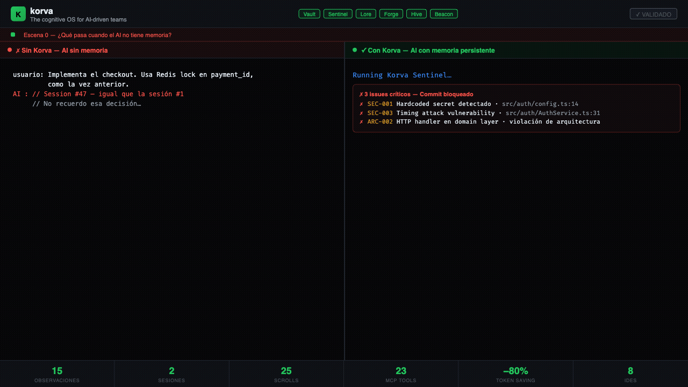

<div align="center">

# 🪶 Korva

### The Operating System for AI-driven Engineering Teams

**Persistent memory · Architecture guardrails · Knowledge injection · Spec-driven workflows**

*Open source · Local-first · Zero cloud · MIT licensed*

[](LICENSE)
[](https://golang.org)
[](https://modelcontextprotocol.io)
[](https://github.com/AlcanDev/korva/actions)
[](https://github.com/AlcanDev/korva/releases)
[](#-quickstart)

[**Quickstart**](#-quickstart) · [**Features**](#-features) · [**Documentation**](docs/) · [**Architecture**](#%EF%B8%8F-architecture) · [**Roadmap**](ROADMAP.md)

</div>

---

## 🎬 Demo

<div align="center">



*32 seconds · 8 scenes · all 6 services · real vault data*

</div>

| Scene | What you see |
|-------|-------------|
| **El Problema** | AI forgets decisions between sessions — race conditions repeat, secrets leak into git |
| **vault_context** | Korva loads 6 observations in 142ms — AI generates correct code on the first try |
| **vault_save** | Bugfix pattern saved with ULID, synced across the team via Hive |
| **Sentinel** | git commit blocked — 3 issues caught: hardcoded secret, timing attack, arch violation |
| **Lore + Forge** | 25 architecture scrolls applied · SDD workflow phase tracked |
| **vault_compress** | Token usage cut by −80% (lite) or −97% (ultra) per session |
| **Real stats** | 15 obs · 23 MCP tools · 25 scrolls · 8 IDEs · all 6 services active |

---

## 🎯 What is Korva?

Korva turns any AI coding assistant — Claude Code, Cursor, GitHub Copilot, OpenCode, Codex, Gemini CLI, Windsurf, VS Code with MCP — into an **architecturally-aware teammate**. It does this with four pillars:

| Pillar | What it does |
|--------|--------------|
| 🧠 **Vault** | Persistent memory across sessions — decisions, patterns, bugs solved. Local SQLite, encrypted at rest. |
| 📜 **Lore** | Curated knowledge **scrolls** auto-injected when your task matches their triggers. |
| 🛡️ **Sentinel** | Pre-commit gate that catches architectural violations before they reach review. |
| 🔮 **Forge** | Spec-Driven Development workflow — five phases from idea to merged PR. |

Plus: **Hive** for opt-in cross-team knowledge sync, **Beacon** for a private dashboard at `localhost:7437`, and the **Teams** licensing tier for organisations that need RBAC, multi-profile support, and code-health analytics.

---

## ⚡ Quickstart

### Install

```bash
# macOS / Linux — single curl
curl -fsSL https://korva.dev/install | bash

# Homebrew
brew install alcandev/tap/korva

# Windows PowerShell
iwr -useb https://korva.dev/install.ps1 | iex

# Verify
korva --version
```

### First-time setup (under 60 seconds)

```bash
# 1. Initialise the vault
korva init

# 2. Wire your AI assistant — auto-detects everything by default
korva setup                  # configure every installed editor at once

# Or pick a subset:
korva setup --vscode --cursor
korva setup --claude         # Claude Code
korva setup --gemini-cli     # Google Gemini CLI
korva setup --opencode       # OpenCode
korva setup --codex          # OpenAI Codex CLI

# 3. Open your editor — Korva is now alive
```

You're done. Your assistant now has structured memory, knowledge injection, and architecture guardrails.

---

## ✨ Features

### 🧠 Persistent Memory (Vault)
- **Local SQLite** — your data never leaves your machine unless you opt in
- **MCP server** at `localhost:7437` exposing 16+ tools for save / search / context
- **Privacy filter** strips secrets, JWTs, emails before anything is persisted
- **Time-travel** — see what your team decided three months ago, with full timeline
- **Project hygiene** — `korva projects list/suggest/consolidate/prune` folds name variants and cleans orphan sessions
- **Obsidian export** — `korva export obsidian --out DIR` renders the vault as markdown with `[[wikilinks]]` so it's browseable in any markdown-native tool

### 📜 Knowledge Scrolls (Lore)
- **24+ curated scrolls** covering NestJS, React, TypeScript, Docker, GitLab CI, MCP, SDD, security, observability, plugins, error handling, cloud sync, and more
- **Auto-loading triggers** — scrolls inject into the AI session only when their files/keywords/tasks match
- **Smart Skill Loader** — Teams tier ships a ranked skill matcher
- **Custom scrolls** — write your own in 5 minutes (see [`skill-authoring`](lore/curated/skill-authoring/SCROLL.md))

### 🛡️ Architecture Guardrails (Sentinel)
- **Pre-commit hook** catches violations of your declared architecture rules
- **Per-team rules** in `sentinel/rules/*.yml`
- **Structured findings** machine-readable for IDE plugins or CI gates
- **Fast** — written in Go, runs on changed files only

### 🔮 Spec-Driven Workflow (Forge)
- **5-phase loop**: Discovery → Specification → Plan → Implementation → Review
- **Stage state** stored in the Vault — survives context resets and team handovers
- **Project conventions** captured as machine-readable rules

### 🔄 Cross-team Sync (Hive — optional)
- **Opt-in cloud sync** with content-addressed chunking
- **Privacy filter** runs at the boundary — only redacted content leaves your machine
- **Conflict-free** — last-write-wins on metadata, immutable chunks

### 🖥️ Private Dashboard (Beacon)
- **Embedded React SPA** — runs on `http://localhost:7437`
- **Zero cloud** — all rendering happens locally
- **Admin panel** for license activation, team management, lore curation

---

## 🏗️ Architecture

```
┌──────────────────────────────────────────────────────────────────┐
│  AI Assistant (Claude Code, Cursor, OpenCode, ...)                │
│                                ↕  MCP / JSON-RPC over stdio       │
├──────────────────────────────────────────────────────────────────┤
│  korva-vault   :7437  ←  HTTP REST + MCP server                   │
│  ├── Vault store     →  SQLite (local, encrypted at rest)         │
│  ├── Privacy filter  →  redact secrets/PII before persist         │
│  ├── Lore engine     →  trigger-based scroll injection            │
│  ├── Hive worker     →  optional cloud sync (opt-in only)         │
│  └── Beacon SPA      →  embedded React dashboard                  │
├──────────────────────────────────────────────────────────────────┤
│  korva CLI                                                        │
│  ├── korva init / setup / status / doctor                         │
│  ├── korva sentinel pre-commit                                    │
│  ├── korva license activate / status                              │
│  └── korva update self-install                                    │
├──────────────────────────────────────────────────────────────────┤
│  Sentinel  →  pre-commit architecture validator (Go)              │
│  Forge     →  5-phase SDD workflow templates                      │
│  Hive      →  optional cross-team knowledge sync                  │
└──────────────────────────────────────────────────────────────────┘
```

**Stack**: Go 1.26 · SQLite (`modernc.org/sqlite`, pure Go, no CGO) · MCP 2024-11-05 · React 19 + Vite 6 (Beacon).

---

## 📚 Documentation

| Doc | Description |
|-----|-------------|
| [**Quickstart**](docs/QUICKSTART.md) | Five-minute setup with your first AI session |
| [**Installation**](docs/INSTALL.md) | All platforms, all package managers |
| [**Architecture**](docs/ARCHITECTURE.md) | How the components fit together |
| [**MCP Tools**](docs/MCP.md) | Every tool the vault exposes, with examples |
| [**CLI Reference**](docs/CLI.md) | Every command, every flag |
| [**Skills / Lore**](docs/SKILLS.md) | How scrolls work, how to author your own |
| [**Deployment**](docs/DEPLOYMENT.md) | Self-host the vault for your team |
| [**Licensing**](docs/LICENSING.md) | Community vs Teams tiers |
| [**Admin Panel**](docs/ADMIN_PANEL.md) | Beacon dashboard guide |
| [**Auto-skills**](docs/AUTOSKILLS.md) | How automatic scroll loading works |
| [**Team Profiles**](docs/team-profile-guide.md) | Per-team configuration |
| [**Contributing**](CONTRIBUTING.md) | Open a PR / report a bug |
| [**Security**](SECURITY.md) | Threat model + responsible disclosure |
| [**Vision**](VISION.md) | Where Korva is going |
| [**Roadmap**](ROADMAP.md) | What's next |

---

## 🆚 Why Korva?

| | Korva | Generic AI Assistants | Cloud Memory Services |
|---|---|---|---|
| Persistent memory | ✅ Local SQLite | ❌ Per-session only | ✅ Cloud-only |
| Privacy by default | ✅ Filter at boundary | ⚠️ Trust the vendor | ❌ All to cloud |
| Architecture rules | ✅ Sentinel pre-commit | ❌ None | ❌ None |
| Knowledge scrolls | ✅ 24+ curated, auto-load | ❌ None | ⚠️ Manual snippets |
| MCP-native | ✅ First-class | ⚠️ Some | ⚠️ Some |
| Self-host | ✅ Single binary | ❌ Vendor-locked | ❌ Vendor-locked |
| Open source | ✅ MIT | ⚠️ Mixed | ❌ Closed |
| Cost | Free (Community) | $20–200 / month | $10–100 / month |

---

## 🔧 Supported Editors

Korva ships first-class integration manifests for every popular AI coding assistant.

| Editor | Status | Setup Command |
|--------|--------|---------------|
| VS Code (MCP)   | ✅ Stable | `korva setup --vscode` |
| Cursor          | ✅ Stable | `korva setup --cursor` |
| Claude Code     | ✅ Stable | `korva setup --claude` |
| Google Gemini CLI | ✅ Stable | `korva setup --gemini-cli` |
| OpenCode        | ✅ Stable | `korva setup --opencode` |
| OpenAI Codex CLI | ✅ Stable | `korva setup --codex` |

Run `korva setup` with no flags to auto-detect every installed editor and
configure them in one shot.

Manifests live in [`integrations/`](integrations/). Each is a thin config that wires the editor to the local vault MCP server.

---

## 💎 Tiers

| Feature | Community | Teams |
|---------|:---------:|:-----:|
| Vault + MCP | ✅ | ✅ |
| All curated scrolls | ✅ | ✅ |
| Sentinel pre-commit | ✅ | ✅ |
| Forge SDD workflow | ✅ | ✅ |
| Beacon dashboard | ✅ | ✅ |
| Smart Skill Loader | — | ✅ |
| Multi-profile | — | ✅ |
| Hive cross-team sync | — | ✅ |
| RBAC + audit log | — | ✅ |
| Code Health analytics | — | ✅ |
| Pattern Mining | — | ✅ |
| Priority support | — | Email / SLA |

→ See [LICENSING.md](docs/LICENSING.md) for the full feature matrix.

---

## 🛠️ Build from source

```bash
git clone https://github.com/AlcanDev/korva.git
cd korva
make all                # sync workspace, build all binaries, run all tests

./bin/korva --version
./bin/korva-vault --help
```

Requires Go 1.26+. Beacon UI requires Node 22+:

```bash
make vault-full         # builds korva-vault with embedded Beacon SPA
make beacon-dev         # runs Beacon dev server on :5173 (HMR)
```

---

## 🤝 Contributing

PRs, issues, and discussions are welcome. Read [CONTRIBUTING.md](CONTRIBUTING.md) for the workflow, and [BEHAVIOR.md](BEHAVIOR.md) for the four behavioural principles every contribution follows.

Conventional Commits are required — see [`release-engineering`](lore/curated/release-engineering/SCROLL.md) for the rules.

---

## 📜 License

**Community core** is [MIT licensed](LICENSE). The licensing server (`forge/licensing-server/`) and Teams features (`internal/license/`) are licensed under [LICENSE-ENTERPRISE.md](LICENSE-ENTERPRISE.md).

---

<div align="center">

**Korva — built for teams who want their AI to actually understand the codebase.**

[Website](https://korva.dev) · [Docs](docs/) · [Releases](https://github.com/AlcanDev/korva/releases) · [Issues](https://github.com/AlcanDev/korva/issues)

*Last updated: 2026-04-30*

</div>
